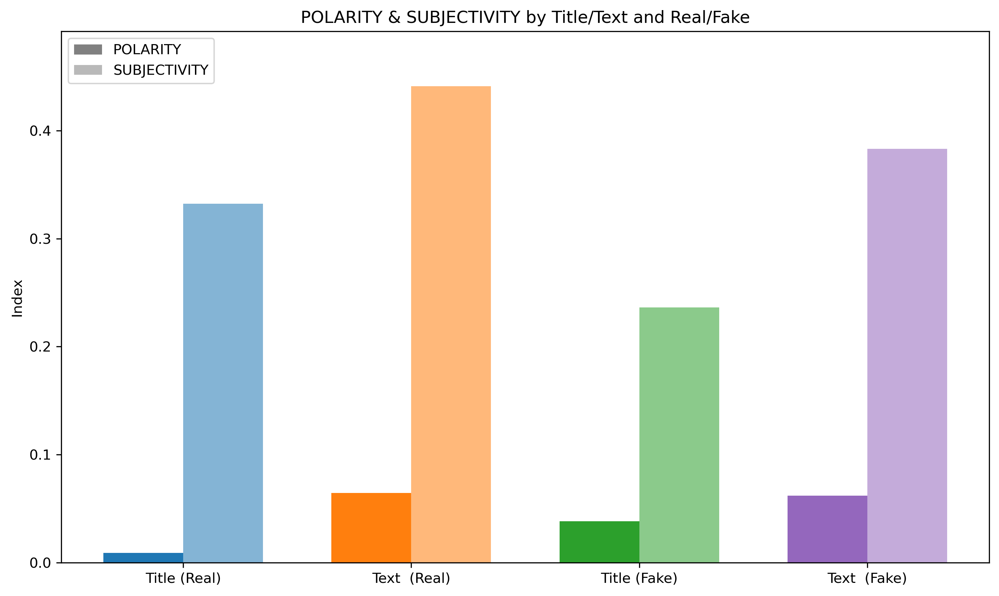

# Fake News Classification Project

## 1. Context

As recent events and elections might have illustrated, what is called *“fake news”*, or misinformation, can have an important impact on political, social, and economic life.  
Beyond the aspect of freedom of speech, their impact may often be negative, biased, wrong, and unfair.  

Therefore, being able to detect them—either to avoid their spread or simply their consideration—could help restore more meaningful debates.  

This project focuses on classifying news articles as **fake or real** using machine learning, deep learning and NLP models.  

---

## 2. Dataset

Source: [Kaggle – Fake News Classification](https://www.kaggle.com/datasets/saurabhshahane/fake-news-classification)

---

## 3. Exploratory Data Analysis (EDA)

- Detection of fake news language patterns  
- Identification of strong discriminators  

---

## 4. Models

- **Machine Learning**  
  - Random Forest  
  - Logistic Regression  
- **Deep Learning**  
  - Bi-LSTM  
- **Transformer**  
  - Pretrained DistilBERT → **Selected Model**

---

## 5. Recommendations & Future Work

- With an **F1 score of 99.50%**, the DistilBERT transformer model demonstrates strong potential for fake news detection.  
- For better generalization, the model should be evaluated on **additional datasets** to ensure robustness beyond the one used in this study.  
- A critical aspect to consider is the **quality and reliability of the input dataset**, as limitations in the initial dataset directly impacted earlier stages of the project. This reinforces the need for careful dataset validation before modeling.  
- The **strong discriminators** identified during the EDA stage may provide a valuable first approach for characterizing the types of news present in the dataset.  
- In future work, these features could be integrated into the **feature engineering and preprocessing** stage, potentially improving the performance of traditional ML models such as Random Forest and Logistic Regression.  
- Combining engineered features with **transformer embeddings** may yield even higher robustness and accuracy.   

